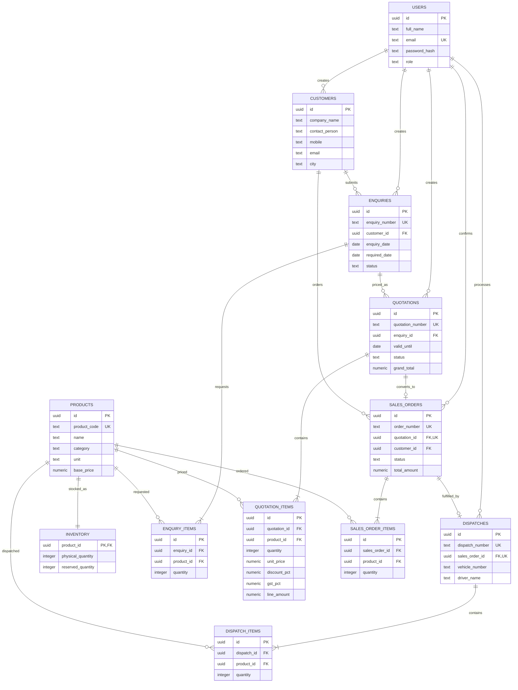

# Database schema and ER diagram

The canonical PostgreSQL schema, including constraints and indexes, is [`server/src/db/schema.sql`](../server/src/db/schema.sql). This diagram summarizes its core relationships.

`UNIQUE(sales_orders.quotation_id)` ensures an accepted quotation creates at most one sales order. `UNIQUE(dispatches.sales_order_id)` permits at most one dispatch per order. Inventory availability is derived as `physical_quantity - reserved_quantity`; database checks prevent negative or over-reserved quantities. See the [implementation guide](IMPLEMENTATION_GUIDE.md) for the workflow and change steps.