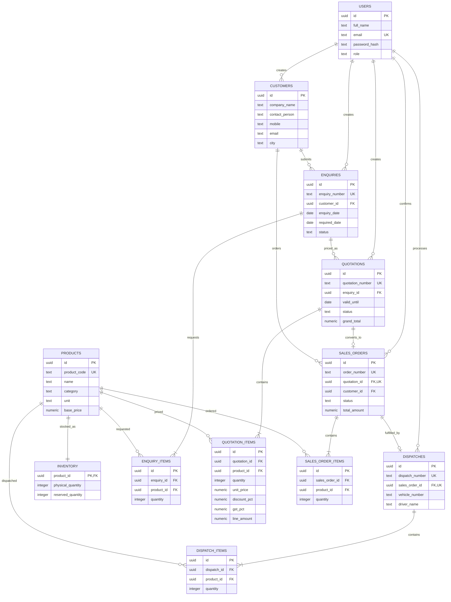

# forgeflow implementation guide

This guide records the relational model, end-to-end workflow, and practical steps for changing the case study implementation. The case study PDF is a requirements source; only its stated product requirements are represented here.

## ER diagram

`UNIQUE(sales_orders.quotation_id)` and `UNIQUE(dispatches.sales_order_id)` are database-level idempotency guards. `inventory` stores physical and reserved quantities; available stock is always derived as `physical_quantity - reserved_quantity`. Check constraints disallow negative stock, over-reservation, invalid prices, and non-positive line quantities.

## Workflow

```mermaid
flowchart LR
  C[Sales: create customer + enquiry] --> E[Enquiry NEW]
  E --> Q[Sales: create quotation<br/>server computes totals]
  Q --> D[Quotation DRAFT]
  D --> S[Sales: submit to admin<br/>Quotation SENT]
  S --> A{Admin review}
  A -->|Accept| W[Enquiry WON<br/>Quotation ACCEPTED]
  A -->|Reject| L[Enquiry LOST<br/>Quotation REJECTED]
  W --> O[Sales: convert once<br/>Sales order PENDING]
  O --> V{Admin confirms?}
  V -->|Lock order + inventory rows| I[Check all items have enough available stock]
  I -->|Any shortfall| F[Rollback; keep order pending]
  I -->|All available| R[Add ordered units to reserved stock<br/>Order CONFIRMED]
  R --> X[Admin: dispatch with vehicle + driver]
  X --> Z[Subtract dispatched units from physical and reserved<br/>Order DISPATCHED]
```

## Request and transaction path

1. React signs in at `POST /api/auth/login`; Express verifies bcrypt and returns an expiring JWT.
2. The client sends that JWT as a bearer token. Express verifies it on protected routes and checks the role again on restricted actions.
3. Sales creates an enquiry and its customer/product lines in one PostgreSQL transaction.
4. Sales creates a quotation against that enquiry. The server calculates each line (discount first, then GST) and stores server-produced totals; client-submitted totals are not accepted.
5. Sales submits the draft quotation to Admin (`DRAFT → SENT`). Admin alone reviews and accepts or rejects it (`SENT → ACCEPTED/REJECTED`); acceptance marks the enquiry `WON`, while rejection marks it `LOST`.
6. Sales alone can convert an accepted quotation. Conversion locks the quotation row, copies quote lines to an order, and the unique quotation FK prevents a second order.
7. Admin confirmation starts a transaction, locks the order, then locks its inventory rows in stable product-ID order. The server checks every requested quantity against physical minus reserved before reserving any item. All updates commit together or roll back together.
8. Admin dispatch locks the order and inventory rows, checks the complete order is reserved, records one dispatch, lowers physical and reserved by the same quantities, and changes the order to `DISPATCHED` in one transaction.

## Safe change procedure

For a live verification request or new business rule, make changes in this order:

1. **Write down the invariant.** Example: `available = physical - reserved - damaged`; decide whether every value must be an integer and whether damaged stock can ever be restored.
2. **Change the relational schema** in `server/src/db/schema.sql`: add columns/tables, `NOT NULL`, foreign keys, unique constraints, and `CHECK` constraints. Keep workflow data in relational columns rather than a JSON blob.
3. **Update demo data** in `server/src/db/seed.js`. Make seed changes safe to re-run and do not overwrite user-managed inventory on every seed.
4. **Update calculations and guards** in `server/src/domain.js`, then update SQL reads/writes in `server/src/app.js`. If a rule spans multiple writes, use `withTransaction`; acquire `FOR UPDATE` locks in a consistent order before reading the values you rely on.
5. **Update API docs** in `docs/openapi.yaml`: request shape, response, auth role, errors, and state transition.
6. **Update UI** in `src/ui/App.jsx` and `src/ui/styles.css`: show the new quantity, submit it through the API, and explain server errors without treating client checks as authoritative.
7. **Add a focused test** in `server/test/domain.test.js` for the new rule, plus a PostgreSQL integration/concurrency test if correctness depends on locks, constraints, or transactions.
8. **Apply and verify**: `npm run db:migrate`, `npm run db:seed`, `npm test`, then walk through the browser workflow from login to dispatch.

### Example: add damaged stock

1. Add `damaged_quantity INTEGER NOT NULL DEFAULT 0 CHECK (damaged_quantity >= 0 AND damaged_quantity <= physical_quantity)` to `inventory`.
2. Change available stock expressions everywhere from `physical - reserved` to `physical - reserved - damaged` (product listing, dashboard, reservation checks, docs, UI).
3. Add an admin-only API update that locks the inventory row and rejects a damaged quantity that would make available stock negative.
4. Add the damaged value to the inventory screen and make the change in its own transaction.
5. Test exact availability, rejection of over-damaging, and the reservation boundary with concurrent database requests.

### Example: allow cancelling a confirmed order

1. Define which statuses can be cancelled and whether dispatch is ever reversible.
2. Add an admin-only cancel endpoint; lock the order and affected inventory rows in product-ID order.
3. Only for `CONFIRMED`, subtract each order line from reserved stock and set the order to `CANCELLED` inside one transaction. Reject `DISPATCHED` and already-cancelled orders.
4. Add an API/UI action, expose the transition in OpenAPI, and test both reservation release and repeated cancellation.

## Case-study checklist

- [x] PERN (PostgreSQL, Express, React, Node) with REST endpoints.
- [x] JWT login, bcrypt password hashes, API authentication and backend roles.
- [x] Customer enquiries with multiple product lines.
- [x] Product master and eight seeded industrial products.
- [x] Quotation lines with server-calculated discount and GST.
- [x] Accepted-only, once-only sales-order conversion.
- [x] Transactional row-locked reservation and dispatch.
- [x] Admin stock adjustment with server-side constraints.
- [x] Four required functional screens (login, enquiries, quotations, orders/inventory).
- [x] ER diagram, workflow, API reference, setup guide, and eight automated tests, including simultaneous inventory reservations.
